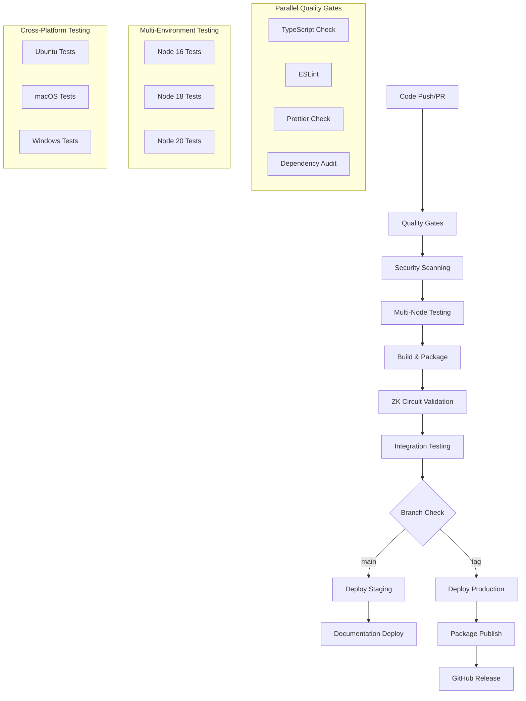

# CI/CD Pipeline Design Document

## Overview

This document outlines the design for a comprehensive CI/CD pipeline for the Solstice Protocol SDK, a TypeScript/Node.js zero-knowledge proof SDK. The pipeline leverages GitHub Actions as the primary platform while maintaining flexibility for other CI/CD systems. The design emphasizes security, reliability, performance optimization, and proper handling of cryptographic components.

The pipeline follows a multi-stage approach: **Code Quality → Security → Build → Test → Deploy → Release**, with parallel execution where possible and comprehensive validation at each stage.

## Architecture

### Pipeline Stages Architecture



### Workflow Orchestration

The pipeline consists of multiple GitHub Actions workflows:

1. **Main CI Workflow** (`ci.yml`) - Triggered on all pushes and PRs
2. **Release Workflow** (`release.yml`) - Triggered on version tags
3. **Security Workflow** (`security.yml`) - Scheduled and event-triggered
4. **Documentation Workflow** (`docs.yml`) - Triggered on main branch changes
5. **Dependency Update Workflow** (`dependencies.yml`) - Scheduled maintenance

## Components and Interfaces

### Core Pipeline Components

#### 1. Quality Gate Controller
**Purpose**: Orchestrates code quality checks and enforces standards
**Interface**:
```typescript
interface QualityGateController {
  runTypeCheck(): Promise<QualityResult>
  runLinting(): Promise<QualityResult>
  runFormatCheck(): Promise<QualityResult>
  validateCoverage(threshold: number): Promise<QualityResult>
  generateQualityReport(): Promise<QualityReport>
}
```

#### 2. Security Scanner
**Purpose**: Performs comprehensive security analysis
**Interface**:
```typescript
interface SecurityScanner {
  scanDependencies(): Promise<SecurityReport>
  scanCode(): Promise<SecurityReport>
  checkLicenseCompliance(): Promise<ComplianceReport>
  validateCircuitSecurity(): Promise<CircuitSecurityReport>
}
```

#### 3. Build Manager
**Purpose**: Handles multi-format builds and artifact generation
**Interface**:
```typescript
interface BuildManager {
  buildAllFormats(): Promise<BuildArtifacts>
  validateArtifacts(): Promise<ValidationResult>
  packageCircuits(): Promise<CircuitPackage>
  generateDeclarations(): Promise<TypeDeclarations>
}
```

#### 4. Test Orchestrator
**Purpose**: Manages test execution across environments
**Interface**:
```typescript
interface TestOrchestrator {
  runUnitTests(nodeVersion: string): Promise<TestResult>
  runIntegrationTests(): Promise<TestResult>
  runCircuitTests(): Promise<CircuitTestResult>
  runCrossPlatformTests(): Promise<PlatformTestResults>
}
```

#### 5. Deployment Manager
**Purpose**: Handles environment-specific deployments
**Interface**:
```typescript
interface DeploymentManager {
  deployToStaging(artifacts: BuildArtifacts): Promise<DeploymentResult>
  deployToProduction(artifacts: BuildArtifacts): Promise<DeploymentResult>
  publishPackage(version: string): Promise<PublishResult>
  deployDocumentation(): Promise<DocumentationDeployment>
}
```

### GitHub Actions Workflow Structure

#### Main CI Workflow Configuration
```yaml
# .github/workflows/ci.yml
name: CI Pipeline
on:
  push:
    branches: [main, develop]
  pull_request:
    branches: [main, develop]

jobs:
  quality-gates:
    strategy:
      matrix:
        check: [typecheck, lint, format, audit]
    
  security-scan:
    needs: quality-gates
    
  test-matrix:
    needs: quality-gates
    strategy:
      matrix:
        node-version: [16, 18, 20]
        os: [ubuntu-latest, macos-latest, windows-latest]
    
  build-and-validate:
    needs: [security-scan, test-matrix]
    
  circuit-validation:
    needs: build-and-validate
    
  integration-tests:
    needs: circuit-validation
```

## Data Models

### Pipeline Configuration Model
```typescript
interface PipelineConfig {
  nodeVersions: string[]
  platforms: Platform[]
  qualityGates: QualityGateConfig
  securityConfig: SecurityConfig
  buildConfig: BuildConfig
  deploymentConfig: DeploymentConfig
}

interface QualityGateConfig {
  coverageThreshold: number
  typeCheckEnabled: boolean
  lintingEnabled: boolean
  formatCheckEnabled: boolean
  failOnWarnings: boolean
}

interface SecurityConfig {
  vulnerabilitySeverityThreshold: 'low' | 'medium' | 'high' | 'critical'
  dependencyScanEnabled: boolean
  codeScanEnabled: boolean
  licenseCheckEnabled: boolean
}

interface BuildConfig {
  formats: BuildFormat[]
  outputDirectory: string
  includeSourceMaps: boolean
  minifyProduction: boolean
  circuitValidation: boolean
}

interface DeploymentConfig {
  environments: Environment[]
  stagingBranch: string
  productionTrigger: 'tag' | 'manual'
  rollbackEnabled: boolean
}
```

### Test Result Models
```typescript
interface TestResult {
  passed: boolean
  coverage: CoverageReport
  duration: number
  platform: Platform
  nodeVersion: string
  errors: TestError[]
}

interface CoverageReport {
  lines: number
  functions: number
  branches: number
  statements: number
  threshold: number
  passed: boolean
}

interface CircuitTestResult extends TestResult {
  circuitValidation: CircuitValidation[]
  proofGeneration: ProofGenerationResult[]
  verificationTests: VerificationResult[]
}
```

### Build Artifact Models
```typescript
interface BuildArtifacts {
  commonjs: BuildOutput
  esm: BuildOutput
  umd: BuildOutput
  declarations: TypeDeclarations
  circuits: CircuitPackage
  documentation: DocumentationOutput
}

interface BuildOutput {
  path: string
  size: number
  hash: string
  sourceMaps: boolean
  minified: boolean
}

interface CircuitPackage {
  circuits: Circuit[]
  verificationKeys: VerificationKey[]
  metadata: CircuitMetadata
}

interface Circuit {
  name: string
  zkeyFile: string
  r1csFile: string
  symFile: string
  wasmFile: string
  verified: boolean
}
```

## Correctness Properties

*A property is a characteristic or behavior that should hold true across all valid executions of a system—essentially, a formal statement about what the system should do. Properties serve as the bridge between human-readable specifications and machine-verifiable correctness guarantees.*

### Property 1: Quality Gate Enforcement
*For any* code submission, if any quality gate fails (TypeScript type checking, ESLint, formatting, or coverage threshold), then the pipeline should halt and prevent progression to subsequent stages.
**Validates: Requirements 2.1, 2.2, 2.3, 2.5, 2.6**

### Property 2: Multi-Environment Test Consistency
*For any* test suite execution across Node.js versions 16, 18, and 20, if tests fail on any supported version, then the overall build should be marked as failed and progression blocked.
**Validates: Requirements 1.1, 1.2, 1.3**

### Property 3: Security Vulnerability Blocking
*For any* security scan result, if high or critical severity vulnerabilities are detected in production or development dependencies, then the pipeline should fail and prevent deployment.
**Validates: Requirements 3.1, 3.2, 3.4**

### Property 4: Build Artifact Completeness
*For any* successful quality gate completion, all expected distribution formats (CommonJS, ESM, UMD), TypeScript declarations, and ZK circuit files should be generated and validated.
**Validates: Requirements 4.1, 4.2, 4.3, 4.4**

### Property 5: ZK Circuit Integrity Validation
*For any* build containing ZK circuits, all required circuit files (.zkey, .r1cs, .sym, verification keys) should be present, validated for integrity, and properly packaged in the final artifact.
**Validates: Requirements 5.1, 5.2, 5.3, 5.5**

### Property 6: Documentation Generation and Deployment
*For any* main branch merge that affects public APIs, documentation should be regenerated using TypeDoc, deployed successfully, and verified for completeness.
**Validates: Requirements 6.1, 6.2, 6.4, 6.5**

### Property 7: Package Publishing Atomicity
*For any* version tag creation, either the complete publishing process (package verification, npm publish, GitHub release creation) succeeds atomically, or all changes are rolled back.
**Validates: Requirements 7.1, 7.2, 7.4, 7.5, 7.6**

### Property 8: Environment Deployment Consistency
*For any* deployment to staging (main branch) or production (version tag) environments, the deployment should only proceed if all previous pipeline stages have passed and deployment success should be verified.
**Validates: Requirements 9.1, 9.2, 9.3**

### Property 9: Cross-Platform Test Equivalence
*For any* comprehensive test execution, ZK circuit operations and platform-agnostic tests should produce equivalent results across Ubuntu, macOS, and Windows platforms.
**Validates: Requirements 12.1, 12.3, 12.4**

### Property 10: Pipeline Caching and Performance Optimization
*For any* pipeline execution with identical inputs (same commit, same configuration), cached dependencies and build artifacts should produce identical outputs while optimizing execution time through parallelization.
**Validates: Requirements 11.1, 11.2, 11.4**

### Property 11: Notification and Monitoring Completeness
*For any* pipeline stage completion, failure, or critical event, appropriate notifications should be delivered to configured channels with detailed logs and execution metrics maintained.
**Validates: Requirements 10.1, 10.2, 10.3, 10.4, 10.5**

### Property 12: Rollback and Error Recovery
*For any* deployment failure or release creation failure, the system should maintain rollback capabilities, provide detailed error information, and preserve the previous working version.
**Validates: Requirements 8.5, 9.4, 9.5**

## Error Handling

### Error Classification and Response

#### Critical Errors (Pipeline Halt)
- **Security vulnerabilities** (high/critical severity)
- **Build failures** (compilation errors, missing artifacts)
- **Test failures** on any supported Node.js version
- **Circuit validation failures**
- **Deployment failures** to production

#### Warning Errors (Continue with Alerts)
- **Medium/low security vulnerabilities**
- **Code coverage** below threshold but above minimum
- **Documentation generation** warnings
- **Performance regression** within acceptable bounds

#### Recovery Strategies
- **Automatic retry** for transient failures (network, resource)
- **Fallback mechanisms** for optional components (documentation, notifications)
- **Rollback procedures** for failed deployments
- **Circuit validation bypass** for emergency releases (with manual approval)

### Error Reporting and Monitoring

```typescript
interface ErrorHandler {
  classifyError(error: PipelineError): ErrorSeverity
  handleCriticalError(error: CriticalError): Promise<void>
  handleWarningError(error: WarningError): Promise<void>
  reportError(error: PipelineError, context: PipelineContext): Promise<void>
  triggerRollback(deployment: FailedDeployment): Promise<RollbackResult>
}

interface PipelineError {
  stage: PipelineStage
  severity: ErrorSeverity
  message: string
  context: ErrorContext
  timestamp: Date
  retryable: boolean
}
```

## Testing Strategy

### Dual Testing Approach

The CI/CD pipeline itself requires comprehensive testing using both unit tests and property-based tests to ensure reliability and correctness.

#### Unit Testing Focus
- **Workflow syntax validation** - Verify GitHub Actions YAML syntax
- **Script functionality** - Test individual pipeline scripts and utilities
- **Configuration parsing** - Validate pipeline configuration handling
- **Error handling scenarios** - Test specific error conditions and recovery
- **Integration points** - Test interactions between pipeline components

#### Property-Based Testing Focus
- **Pipeline determinism** - Same inputs should produce same outputs
- **Stage dependency validation** - Verify proper stage ordering and dependencies
- **Resource cleanup** - Ensure proper cleanup after pipeline execution
- **Configuration consistency** - Test pipeline behavior across different configurations
- **Parallel execution safety** - Verify thread-safe operations in parallel stages

#### Property Test Configuration
- **Minimum 100 iterations** per property test due to randomization
- **GitHub Actions simulation** environment for testing workflows
- **Mock external services** (npm registry, security scanners) for reliable testing
- **Property test tagging**: **Feature: cicd-pipeline, Property {number}: {property_text}**

### Pipeline Testing Levels

#### 1. Workflow Validation Tests
```yaml
# Test workflow syntax and structure
- name: Validate Workflow Syntax
  run: |
    yamllint .github/workflows/*.yml
    actionlint .github/workflows/*.yml
```

#### 2. Component Integration Tests
```typescript
// Test pipeline component interactions
describe('Pipeline Integration', () => {
  it('should execute quality gates before security scanning', async () => {
    const pipeline = new PipelineOrchestrator(testConfig)
    const result = await pipeline.execute(mockCommit)
    expect(result.stageOrder).toEqual(['quality', 'security', 'test', 'build'])
  })
})
```

#### 3. End-to-End Pipeline Tests
```typescript
// Test complete pipeline execution
describe('E2E Pipeline Tests', () => {
  it('should complete full pipeline for valid commit', async () => {
    const result = await runPipelineE2E(validCommit)
    expect(result.success).toBe(true)
    expect(result.artifacts).toBeDefined()
    expect(result.deployments).toHaveLength(2) // staging + docs
  })
})
```

### Testing Infrastructure Requirements

- **GitHub Actions Runner** simulation environment
- **Docker containers** for isolated testing
- **Mock services** for external dependencies
- **Test data generators** for various commit scenarios
- **Performance benchmarking** tools for pipeline optimization
- **Security testing** tools for vulnerability simulation